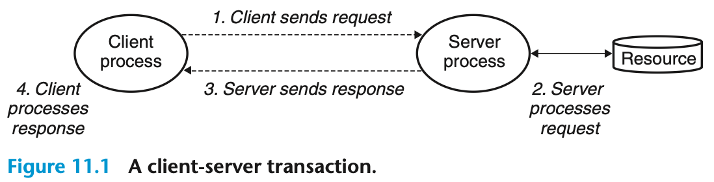

- 네트워크 응용프로그램은 동일한 기본적인 프로그래밍 모델인 '클라이언트-서버 모델'에 기초하고 있다.

### 11.1 클라이언트-서버 프로그래밍 모델

#### 용어
- 프로세스 : os가 관리하는 실행 중인 프로그램으로 메모리 영역에 저장되는 실행 상태를 갖는다.
- 트랜잭션 : 최소 작업 단위
- 머신 : 프로세스가 올라가서 실행되는 컴퓨터
- 호스트 : 네트워크에 참여하는 주소가 있고, 프로세스가 올라가서 실행되는 컴퓨터. 네트워크 계층 구조의 가장자리 노드로 네트워크 정보를 최초 송신하고 최종 수신한다.

#### 내용 정리
- 서버는 일부 리소스를 관리하고, 클라이언트에 서비스를 제공한다.

