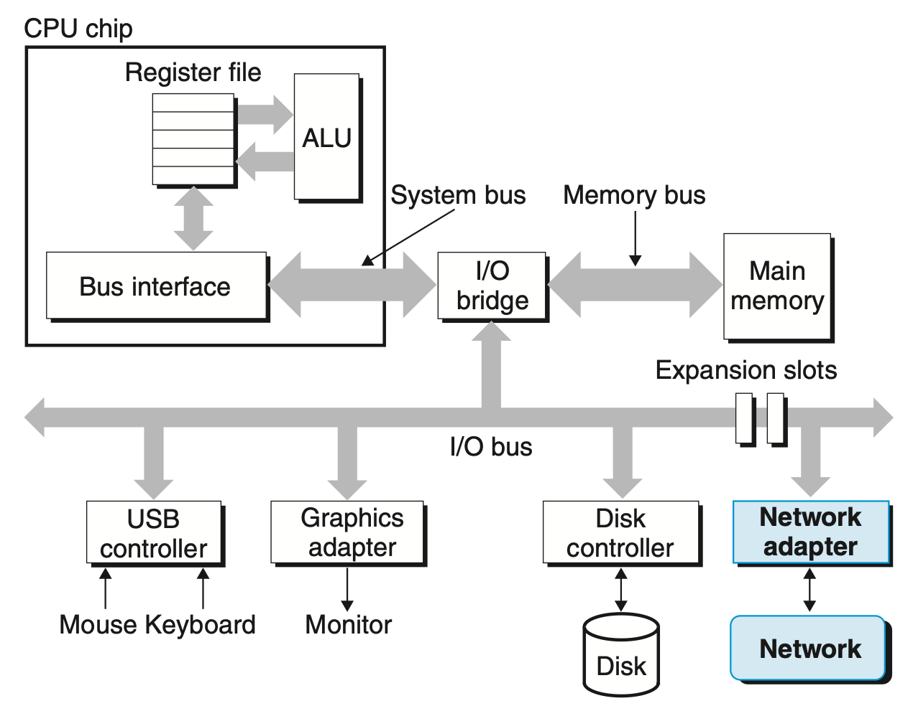

### 11.2 네트워크

이 절의 목적은 전기 신호나 케이블 구조를 깊게 배우는 것이 아니다.  
`네트워크 프로그래밍`을 위해 "호스트 입장에서 네트워크가 어떤 I/O 장치처럼 보이는가"를 이해하는 데 집중하면 된다.

#### 호스트에게 네트워크는 I/O 디바이스이다

- 네트워크는 디스크나 키보드처럼 호스트가 데이터를 주고받는 `I/O 장치`로 볼 수 있다.
- 네트워크 어댑터(`NIC`)는 운영체제와 실제 네트워크 사이를 연결한다.
- 프로그램은 직접 전선을 다루지 않고, 운영체제가 제공하는 소켓 인터페이스를 통해 네트워크를 사용한다.

#### NIC와 커널 버퍼

- 수신 데이터는 NIC를 거쳐 커널 메모리 쪽 버퍼로 이동한다.
- 송신 데이터도 사용자 프로그램이 바로 네트워크 카드에 쓰는 것이 아니라 커널을 통해 전달된다.
- 그래서 애플리케이션 입장에서는 "소켓에 쓰면 네트워크로 나간다"는 추상화만 이해하면 된다.

#### 이번 과제에서 중요한 관점

- Tiny와 Proxy는 네트워크를 "문자열이 오가는 파일 같은 통로"로 다룬다.
- 실제로는 패킷, 드라이버, 인터럽트가 뒤에서 일하지만, 과제 수준에서는 소켓과 `fd` 추상화가 핵심이다.

## 꼭 알아둘 네트워크 용어

### 패킷

- 네트워크를 통해 이동하는 데이터 조각이다.
- 하지만 애플리케이션은 주로 패킷 단위보다 `바이트 스트림` 관점에서 TCP를 사용한다.

### 대역폭과 지연시간

- `대역폭`: 한 번에 얼마나 많이 보낼 수 있는가
- `지연시간`: 한 번 왕복하는 데 얼마나 오래 걸리는가

Proxy의 캐시가 체감 속도를 개선하는 이유를 설명할 때 도움이 된다.

### LAN / WAN / Internet

- `LAN`: 가까운 내부 네트워크
- `WAN`: 넓은 지역 네트워크
- `Internet`: 전 세계적으로 연결된 네트워크들의 집합

이번 장은 이 전체 위에서 동작하는 `TCP/IP 기반 프로그래밍`에 초점을 둔다.

## TCP/IP, UDP를 과제 기준으로 보기

### TCP

- 연결형 프로토콜
- 순서 보장
- 손실 복구
- 바이트 스트림 제공

Tiny와 Proxy는 HTTP를 TCP 위에서 다루므로, 데이터가 순서대로 도착한다는 가정이 가능하다.

### UDP

- 비연결형 프로토콜
- 순서/재전송 보장 없음
- 오버헤드가 적음

이번 과제 구현은 UDP가 아니라 TCP 중심이다.  
즉, UDP는 "비교 대상" 정도로 이해하면 충분하다.

## 11.2를 읽고 나서 답할 수 있어야 하는 질문

1. 왜 네트워크를 I/O 장치라고 볼 수 있는가?
2. 왜 애플리케이션은 NIC 대신 소켓 API를 사용하는가?
3. Tiny가 TCP 위에서 동작하기 때문에 얻는 이점은 무엇인가?
