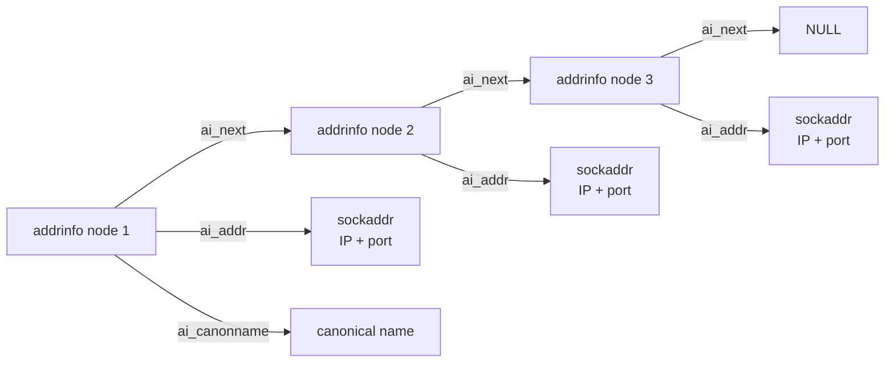
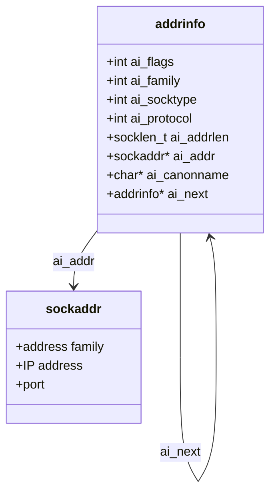

# `open_listenfd()` 공부 노트

이 문서는 CSAPP의 `open_listenfd()`가 무엇을 하는 함수인지, 그리고 그 안에서 쓰이는 `getaddrinfo()`와 `struct addrinfo`를 함께 이해하기 위한 정리다.

## 1. `open_listenfd()`는 왜 필요한가

서버는 클라이언트의 연결 요청을 받기 전에 아래 과정을 거쳐야 한다.

1. 소켓 생성
2. 주소와 포트에 소켓 연결
3. 해당 소켓을 `listen` 상태로 전환

이 과정을 매번 직접 쓰면 길고 실수도 많다.  
그래서 CSAPP는 서버 소켓 생성 흐름을 `open_listenfd()`로 감싸서 제공한다.

## 2. 반환값 의미

- 성공: `listen fd` 반환
- 실패: `-1` 반환

그리고 래퍼 함수인 `Open_listenfd()`는:

- 성공: `listen fd` 반환
- 실패: 에러 메시지 출력 후 종료

## 3. 전체 흐름

`open_listenfd(port)`의 핵심 흐름은 아래와 같다.

```text
getaddrinfo()
  -> addrinfo 후보 리스트 받기
  -> 각 후보에 대해 socket()
  -> setsockopt()
  -> bind()
  -> 성공한 소켓에 listen()
  -> listen fd 반환
```

즉 이 함수는 "`이 포트에서 연결 요청을 받을 수 있는 서버 소켓`을 준비해 주는 함수"라고 보면 된다.

## 4. 코드 관점에서 하는 일

대략 아래 일을 내부에서 처리한다.

### `getaddrinfo(NULL, port, &hints, &listp)`

- 주어진 포트에 바인드할 수 있는 주소 후보들을 가져온다.
- 서버용이므로 보통 `AI_PASSIVE` 플래그를 사용한다.

### `socket(...)`

- 후보 주소 정보에 맞는 소켓을 만든다.

### `setsockopt(...)`

- 보통 `SO_REUSEADDR` 같은 옵션을 설정한다.
- 서버를 빠르게 재실행할 때 `Address already in use` 문제를 줄이는 데 도움된다.

### `bind(...)`

- 생성한 소켓을 실제 주소/포트에 연결한다.

### `listen(...)`

- 해당 소켓을 연결 요청을 기다리는 `listen socket`으로 바꾼다.

## 5. `struct addrinfo`는 왜 필요한가

`getaddrinfo()`는 "이 호스트/포트에 대해 어떤 주소와 소켓 설정을 쓰면 되는가?"에 대한 후보들을 `struct addrinfo` 연결 리스트로 반환한다.

즉 `struct addrinfo`는:

- IPv4인지 IPv6인지
- TCP인지 UDP인지
- 실제 주소 정보는 무엇인지
- 다음 후보는 무엇인지

를 담고 있는 구조체다.

## 6. `struct addrinfo` 구조

```c
struct addrinfo
{
  int ai_flags;
  int ai_family;
  int ai_socktype;
  int ai_protocol;
  socklen_t ai_addrlen;
  struct sockaddr *ai_addr;
  char *ai_canonname;
  struct addrinfo *ai_next;
};
```

## 7. 구조체를 그림으로 보기



핵심은 `addrinfo`가 하나가 아니라 `연결 리스트`라는 점이다.  
`open_listenfd()`는 이 후보들을 하나씩 시도하다가 성공하는 것을 사용한다.

## 8. 필드별 의미

| 필드 | 의미 | 이번 과제에서 이해할 수준 |
| --- | --- | --- |
| `ai_flags` | 주소 해석 옵션 | 서버에서는 `AI_PASSIVE`가 중요하다. |
| `ai_family` | 주소 체계 | `AF_INET`(IPv4), `AF_INET6`(IPv6) |
| `ai_socktype` | 소켓 종류 | `SOCK_STREAM`이면 TCP |
| `ai_protocol` | 세부 프로토콜 | 보통 TCP/UDP 구분용 |
| `ai_addrlen` | 주소 구조체 길이 | `bind()`에 같이 넘김 |
| `ai_addr` | 실제 주소 정보 | IP + port를 담는 핵심 필드 |
| `ai_canonname` | 정식 이름 | 이번 과제에서는 중요도 낮음 |
| `ai_next` | 다음 후보 | 연결 리스트로 순회할 때 사용 |

## 8-1. 각 필드 자세히 보기

아래 구조체를 기준으로 하나씩 보면 된다.

```c
struct addrinfo
{
  int ai_flags;
  int ai_family;
  int ai_socktype;
  int ai_protocol;
  socklen_t ai_addrlen;
  struct sockaddr *ai_addr;
  char *ai_canonname;
  struct addrinfo *ai_next;
};
```

### `int ai_flags`

`getaddrinfo()`에게 주는 추가 요청 조건이다.  
즉 "주소를 어떤 방식으로 해석해 달라"는 힌트라고 보면 된다.

자주 보는 값:

- `AI_PASSIVE`
- `AI_NUMERICSERV`
- `AI_ADDRCONFIG`

`open_listenfd()`에서 중요한 이유:

- 서버는 특정 포트에 `bind()`할 주소를 찾아야 한다.
- 이때 `AI_PASSIVE`를 주면 `getaddrinfo()`가 서버 소켓 생성에 적합한 주소를 준비한다.
- `hostname` 자리에 `NULL`을 넣고 `AI_PASSIVE`를 주면 보통 "현재 호스트의 모든 인터페이스에서 받을 수 있는 주소" 후보를 돌려준다.

초보자용 해석:

- "주소 후보를 찾을 때 붙이는 옵션 모음"

### `int ai_family`

주소 체계(address family)를 뜻한다.  
즉 이 주소가 IPv4인지 IPv6인지 구분하는 필드다.

대표 값:

- `AF_INET`: IPv4
- `AF_INET6`: IPv6
- `AF_UNSPEC`: 둘 다 허용

왜 필요한가:

- 소켓을 만들 때 `socket(ai_family, ...)`처럼 사용한다.
- 즉 단순한 설명용 정보가 아니라 실제 소켓 생성 방식에 직접 들어간다.

예를 들어:

- `AF_INET`이면 IPv4용 소켓
- `AF_INET6`이면 IPv6용 소켓

초보자용 해석:

- "이 주소 후보가 어떤 주소 형식인지 알려주는 값"

### `int ai_socktype`

소켓 종류를 뜻한다.  
이번 과제에서는 주로 TCP/UDP를 구분하는 역할로 이해하면 된다.

대표 값:

- `SOCK_STREAM`: TCP
- `SOCK_DGRAM`: UDP

왜 필요한가:

- `socket(ai_family, ai_socktype, ai_protocol)`처럼 실제 소켓 생성에 사용된다.
- Tiny와 echo 서버는 TCP를 쓰므로 보통 `SOCK_STREAM`을 사용한다.

`SOCK_STREAM`이 의미하는 것:

- 연결형 통신
- 순서 보장
- 바이트 스트림

초보자용 해석:

- "이 소켓이 TCP 스타일인지 UDP 스타일인지 알려주는 값"

### `int ai_protocol`

세부 프로토콜 번호다.  
`ai_socktype`이 큰 분류라면, `ai_protocol`은 좀 더 구체적인 프로토콜을 나타낸다.

대표적으로:

- TCP면 `IPPROTO_TCP`
- UDP면 `IPPROTO_UDP`
- 또는 `0`

왜 필요한가:

- 대부분의 경우 `ai_family`, `ai_socktype`만으로도 시스템이 적절한 프로토콜을 정할 수 있다.
- 하지만 보다 명시적으로 지정하거나, `getaddrinfo()`가 정확한 조합을 알려줄 때 이 값이 사용된다.

실제 사용 방식:

```c
socket(p->ai_family, p->ai_socktype, p->ai_protocol);
```

초보자용 해석:

- "이 소켓이 어떤 프로토콜을 쓸지 알려주는 더 구체적인 값"

### `socklen_t ai_addrlen`

`ai_addr`가 가리키는 주소 구조체의 길이다.

왜 필요한가:

- `bind()`나 `connect()`는 주소 포인터만 받는 것이 아니라 "그 주소 구조체가 몇 바이트인지"도 함께 알아야 한다.
- 주소 구조체는 IPv4와 IPv6에서 크기가 다를 수 있다.

예:

```c
bind(listenfd, p->ai_addr, p->ai_addrlen);
```

즉:

- `ai_addr`: 주소 데이터 시작 위치
- `ai_addrlen`: 그 주소 데이터 크기

초보자용 해석:

- "주소 정보 박스의 크기"

### `struct sockaddr *ai_addr`

가장 중요한 필드 중 하나다.  
실제 소켓 주소 정보를 가리키는 포인터다.

이 안에는 보통 다음 정보가 들어 있다.

- IP 주소
- 포트 번호
- 주소 체계 정보

중요한 점:

- 타입은 `struct sockaddr *`지만,
- 실제 메모리 내용은 상황에 따라 `struct sockaddr_in`(IPv4) 또는 `struct sockaddr_in6`(IPv6)일 수 있다.

왜 포인터인가:

- 주소 구조체 크기가 상황마다 달라질 수 있어서
- 공통 타입인 `struct sockaddr *`로 가리키게 만든 것이다.

실제 사용 방식:

```c
bind(listenfd, p->ai_addr, p->ai_addrlen);
connect(clientfd, p->ai_addr, p->ai_addrlen);
```

초보자용 해석:

- "진짜 IP와 port가 들어 있는 핵심 주소 데이터"

### `char *ai_canonname`

정식 이름(canonical name)을 가리키는 문자열 포인터다.

예를 들어:

- 별칭(alias) 대신 대표 호스트 이름
- DNS 해석 후 얻은 정규 이름

이번 과제에서 중요도가 낮은 이유:

- `open_listenfd()`나 `open_clientfd()`는 보통 실제 연결/바인드가 목적이다.
- 그래서 `ai_family`, `ai_socktype`, `ai_addr` 같은 필드가 핵심이고,
- `ai_canonname`은 거의 직접 쓰지 않는다.

초보자용 해석:

- "이 주소의 대표 이름이 필요할 때 쓰는 문자열"

### `struct addrinfo *ai_next`

다음 `addrinfo` 노드를 가리키는 포인터다.  
이 필드 때문에 `struct addrinfo` 결과는 연결 리스트가 된다.

왜 연결 리스트인가:

- 한 호스트/포트 조합에 대해 가능한 주소 후보가 여러 개일 수 있기 때문이다.
- 예:
  - IPv4 후보
  - IPv6 후보
  - 여러 인터페이스 후보

`open_listenfd()`에서 어떻게 쓰는가:

```c
for (p = listp; p; p = p->ai_next) {
    ...
}
```

이렇게 첫 후보부터 시작해서 다음 후보로 계속 넘어간다.

초보자용 해석:

- "다음 주소 후보로 이동하는 링크"

## 8-2. 필드들이 실제 코드에서 연결되는 방식

아래 한 줄이 `addrinfo` 구조체를 왜 배우는지 가장 잘 보여준다.

```c
listenfd = socket(p->ai_family, p->ai_socktype, p->ai_protocol);
bind(listenfd, p->ai_addr, p->ai_addrlen);
```

이 코드를 필드 기준으로 읽으면:

- `ai_family`: IPv4/IPv6 중 어떤 주소 체계를 쓸지
- `ai_socktype`: TCP/UDP 중 어떤 종류의 소켓인지
- `ai_protocol`: 세부 프로토콜이 무엇인지
- `ai_addr`: 실제 바인드할 주소가 어디인지
- `ai_addrlen`: 그 주소 구조체가 몇 바이트인지

그리고 실패하면:

- `ai_next`로 다음 후보를 시도한다

즉 `struct addrinfo`는 단순 설명용 구조체가 아니라,  
`socket`, `bind`, `connect` 호출에 필요한 정보를 한 묶음으로 제공하는 실전용 구조체다.

## 9. 시각적으로 한 번 더 정리



이 그림에서 중요한 포인트는 두 가지다.

- `ai_addr`는 실제 주소 데이터를 가리킨다.
- `ai_next`는 다음 후보 `addrinfo`를 가리킨다.

## 10. `open_listenfd()`에서 `addrinfo`가 쓰이는 방식

```text
getaddrinfo()
  -> listp가 첫 번째 addrinfo를 가리킴
  -> p = listp부터 시작
  -> p = p->ai_next로 다음 후보 이동
  -> 각 후보마다 socket / bind 시도
  -> bind 성공한 후보 사용
```

즉, `open_listenfd()`는 단일 주소를 바로 쓰는 함수가 아니라,  
`getaddrinfo()`가 준 여러 후보를 순회하면서 "실제로 bind 가능한 후보"를 찾는 함수다.

## 11. 공부 포인트

이 함수에서 꼭 이해해야 하는 건 아래 네 가지다.

1. 서버 소켓은 `socket -> bind -> listen` 흐름으로 준비된다.
2. `open_listenfd()`는 그 과정을 감싼 helper 함수다.
3. `getaddrinfo()`는 주소 후보를 `addrinfo` 연결 리스트로 준다.
4. `ai_addr`는 실제 주소 정보, `ai_next`는 다음 후보 링크다.

## 12. 한 줄 요약

`open_listenfd()`는 주어진 포트에서 연결 요청을 받을 수 있는 `listen socket`을 준비해 반환하는 함수이고, 내부적으로는 `getaddrinfo()`가 돌려준 `struct addrinfo` 후보들을 순회하면서 적절한 주소에 `bind`와 `listen`을 수행한다.
